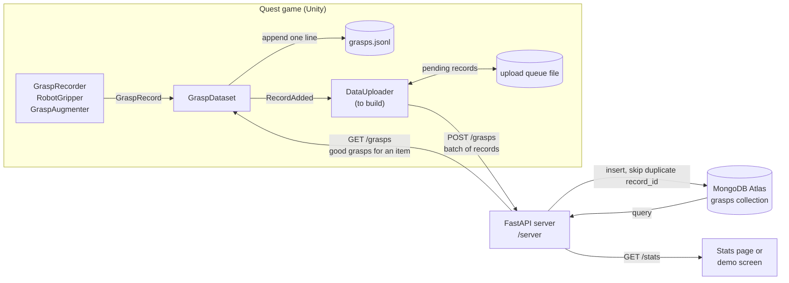

# SortQuest

**Every time you play, a recycling robot gets better at its job.**

SortQuest is a virtual reality game for the Meta Quest in which players sort trash at a recycling plant with their bare hands. Every item they pick up teaches a simulated robot gripper how to grab it. The robot then tries to sort the same items on its own, and players can watch its accuracy improve as more people play.

Built at HackGT 13 by Alan, Dean, Chris, and Adit.

## Why we are making it

Recycling works only when materials are separated correctly. Plastic, metal, and paper each go to a different process, and a single lithium battery in the wrong stream can start a fire at a sorting facility. Much of this sorting is still done by people standing at conveyor belts, and robots that could help struggle with the huge variety of shapes and materials in real trash.

Robots learn to grasp objects from examples, and good examples are slow and expensive to collect. People, on the other hand, are naturally good at picking things up. SortQuest turns that skill into training data: players have fun sorting trash, and every successful grab becomes a demonstration a robot can learn from. The game also teaches players which items belong in which bin, including hazardous items like batteries.

## How it works

1. **Sort.** Trash rides a conveyor belt toward the player. The player grabs each item with hand tracking and drops it into one of four bins: metal (blue), plastic (yellow), paper (green), or hazardous (red). Correct sorts score points and wrong sorts lose points.
2. **Record.** When the player grabs an item, the game converts their hand into a two finger robot gripper grasp. The grasp center sits between the thumb and index fingertips, the fingers close along the line between them, and the gripper approaches from the direction of the back of the hand. The grasp is stored relative to the item, so it still applies wherever the item ends up.
3. **Judge.** A grasp counts as good data only if the item landed in the correct bin without being dropped.
4. **Learn.** For each type of item, the robot picks the grasp that the most successful players agree on, rather than averaging grasps together. Averaging a grasp on the left of a bottle with one on the right would produce a grasp on empty air. With no data yet, the robot guesses, and it often fails.
5. **Improve.** The robot sorts items itself while the game shows its accuracy and confidence, so players can see their demonstrations making it better.

## Current status

| Milestone | Contents | Status |
|---|---|---|
| 1 | Conveyor belt, trash items, spawner, sorting bins with score | Done |
| 2 | Hand to gripper conversion, grasp recording, local grasp dataset | Done |
| 3 | Grasp policy and a floating robot gripper that sorts items near the end of the belt | Done |
| 4 | Game flow: intro, human round, training, robot round, teach me (with a robot retry), results | Done |
| 5a | Learning visuals (accuracy chart, confidence bars, ghost grippers, grab dots) and simulation checked grasp augmentation | Done |
| 5b | Upload grasps to a FastAPI and MongoDB Atlas server (see Developer notes) | Planned |

The six starting items are an aluminum can, a plastic bottle, a cardboard box, crumpled paper, an AA battery, and a power bank. Each bin has a sign listing what goes in it, and the item in the player's hand shows its name.

## Tech stack

* Unity 6.3 LTS (6000.3.25f1) with the Universal Render Pipeline, targeting Android for the Quest
* Meta XR SDK v207 (Interaction SDK for hand tracking and grabbing) on OpenXR
* Planned: a Python FastAPI server with MongoDB Atlas in `/server` for collecting grasps from many players

## Getting started

1. Install Unity 6000.3.25f1 through Unity Hub, including Android Build Support.
2. Clone this repository and open the folder in Unity Hub. The first import takes a few minutes.
3. Open `Assets/Scenes/SampleScene`.
4. Press Play with one of these connected:
   * **Meta Quest Link:** a Quest headset connected to the PC by USB cable or Air Link.
   * **Meta XR Simulator:** no headset needed. Turn on its runtime toggle, press Play, then set both inputs to Hand. Released items drop straight down in the simulator because its hands swing with the view.

To test in a scene of your own without editing the main scene, create and save a new scene, then run the **SortQuest** menu items in order: **Build Milestone 1 Scene**, **Add Grasp Recording (Milestone 2)**, **Add Robot Gripper (Milestone 3)**, **Add Game Manager (Milestone 4)**, and **Add Learning Visuals and Augmenter (Milestone 5)**. Each is safe to run more than once.

## Grasp data

Grasps are saved locally as JSON Lines (one record per line) in `grasps.jsonl` under Unity's persistent data path. On Windows that is `%USERPROFILE%\AppData\LocalLow\DefaultCompany\SortQuest\`, and **SortQuest > Open Grasp Data Folder** opens it. The game never waits on the network.

```json
{
  "session_id": "s-20260926-0412",
  "player": "anon-3f2a",
  "timestamp": "2026-09-26T14:03:11Z",
  "source": "human",
  "item_type": "battery_aa",
  "correct_bin": "hazardous",
  "grasp": { "pos_local": [0.001, 0.012, -0.003], "rot_local": [0, 0.707, 0, 0.707], "width_m": 0.016 },
  "item_pose_world": { "pos": [0.42, 0.95, 0.30], "rot": [0, 0, 0, 1] },
  "outcome": { "bin": "hazardous", "correct": true, "dropped": false, "hold_s": 1.6 },
  "hand": "right"
}
```

Positions are in meters and rotations are quaternions written as [x, y, z, w]. The grasp is expressed in the item's frame, using its position and rotation but not its scale. `source` is `human` (a player's grab), `augmented` (a variation of a good human grasp that passed the robot's physics checks), or `robot` (one of the robot's own attempts). The robot learns from `human` and `augmented` records only.

Before collecting real data on the headset, move any `grasps.jsonl` recorded in the Meta XR Simulator out of the folder. Simulated pinches are not realistic and would pull the robot toward poor grasps.

## Project layout

| Path | Contents |
|---|---|
| `Assets/Scripts/` | Game code (namespace `SortQuest`) |
| `Assets/Editor/` | Editor menu tools that build the scene and prefabs |
| `Assets/Prefabs/` | The six trash items |
| `Assets/Scenes/SampleScene.unity` | Main scene |
| `CLAUDE.md` | Design notes and conventions for the team and for AI coding assistants |

## Developer notes: server and MongoDB

This section is for whoever builds the server (milestone 5b). The game side is finished up to the point where records are saved locally; nothing in Unity talks to a network yet.

### Why the game goes through an API

Unity never connects to MongoDB directly. The MongoDB connection string would have to ship inside the Quest app, where anyone could extract it and read or delete the database. Instead, the game sends plain JSON over HTTPS to a small FastAPI server in `/server`, and only the server holds the connection string, in a gitignored `.env` file (`MONGODB_URI=...`). This also lets the server validate records before storing them.

### Where the Unity code touches the data

| File | Role today | What changes for the server |
|---|---|---|
| `Assets/Scripts/GraspRecord.cs` | Defines the JSON record (see Grasp data above) and helpers that create human, robot, and augmented records | Add a unique `record_id` (a GUID string) set when a record is created, so the server can ignore duplicates when an upload is retried |
| `Assets/Scripts/GraspDataset.cs` | Keeps all records in memory, appends each one to `grasps.jsonl`, and raises `RecordAdded` for every new record | Nothing, apart from optionally merging records downloaded from the server |
| `Assets/Scripts/DataUploader.cs` | Does not exist yet | New script: listens to `GraspDataset.RecordAdded`, adds each record to a local pending queue file, and sends batches in the background with `UnityWebRequest`. On failure it keeps the queue and retries later. The game must never wait on it |
| `GraspRecorder.cs`, `RobotGripper.cs`, `GraspAugmenter.cs` | Create the `human`, `robot`, and `augmented` records | Nothing |

Records are created in three places, but all of them pass through `GraspDataset.Add`, so the uploader only needs to hook that one event.

### Data flow



### Suggested API

| Method and path | Request | Response | Purpose |
|---|---|---|---|
| `GET /health` | nothing | `{"ok": true}` | Lets the game and the team check the server is up |
| `POST /grasps` | `{"records": [GraspRecord, ...]}`, up to about 100 per batch | `{"inserted": 12, "duplicates": 0}` | Store new records from a headset |
| `GET /grasps?item_type=battery_aa&good=true&source=human,augmented&limit=500` | query parameters | `{"records": [GraspRecord, ...]}` | Optional: let a headset learn from every player's good grasps, not just its own |
| `GET /stats` | nothing | counts per item type and source, good grasp counts, robot success rate over time | A live stats page for judges, and data for charts |

Notes for the server:

* **Storage:** one `grasps` collection, one document per record, stored exactly as the game sends it plus a server `received_at` timestamp. Useful indexes are a unique index on `record_id`, and a compound index on `item_type`, `source`, `outcome.correct`, and `outcome.dropped`.
* **Validation:** a Pydantic model can mirror the record. `source` must be `human`, `augmented`, or `robot`; `pos_local` and `pos` have 3 numbers; `rot_local` and `rot` have 4. A good grasp is `outcome.correct == true` and `outcome.dropped == false`.
* **Security:** there are no user accounts. A shared API key header can stop casual misuse, but it ships in the app, so treat it as a speed bump, not a secret. Validate every record and cap batch sizes.
* **Reaching the server from the Quest:** the headset needs a public HTTPS address (for example a hosted service or a tunnel). Android blocks plain `http://` by default, so HTTPS avoids extra Unity settings.
* **Game rule:** uploads are best effort. If the server is down, records stay in the local queue and in `grasps.jsonl`, and gameplay is unaffected.
