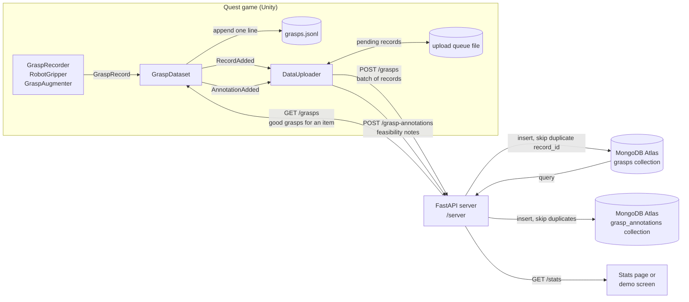

# SortQuest

**Every time you play, a recycling robot gets better at its job.**

SortQuest is a virtual reality game for the Meta Quest in which players sort trash at a recycling plant with their bare hands. Every item they pick up teaches a simulated robot gripper how to grab it. The robot then tries to sort the same items on its own, and players can watch its accuracy improve as more people play.

Built at HackGT 13 by Alan, Dean, Chris, and Adit.

## Why we are making it

Recycling works only when materials are separated correctly. Plastic, metal, and paper each go to a different process, and a single lithium battery in the wrong stream can start a fire at a sorting facility. Much of this sorting is still done by people standing at conveyor belts, and robots that could help struggle with the huge variety of shapes and materials in real trash.

Robots learn to grasp objects from examples, and good examples are slow and expensive to collect. People, on the other hand, are naturally good at picking things up. SortQuest turns that skill into training data: players have fun sorting trash, and every successful grab becomes a demonstration a robot can learn from. The game also teaches players which items belong in which bin, including hazardous items like batteries.

## How it works

1. **Sort.** Trash rides a conveyor belt toward the player. The player grabs each item with hand tracking and drops it into one of four bins: metal (blue), plastic (yellow), paper (green), or hazardous (red). Correct sorts score points and wrong sorts lose points.
2. **Record.** When the player grabs an item, the game converts their hand into a two finger robot gripper grasp. The grasp center sits between the thumb and index fingertips, the fingers close along the line between them, and the gripper approaches from the direction of the back of the hand. The grasp is stored relative to the item, so it still applies wherever the item ends up.
3. **Judge.** A grasp counts as good data only if the item landed in the correct bin without being dropped.
4. **Learn.** For each type of item, the robot picks the grasp that the most successful players agree on, rather than averaging grasps together. Averaging a grasp on the left of a bottle with one on the right would produce a grasp on empty air. With no data yet, the robot guesses, and it often fails.
5. **Improve.** The robot sorts items itself while the game shows its accuracy and confidence, so players can see their demonstrations making it better. During the robot's turn, the game also counts how many of the items that came down the belt the robot actually put in the right bin, including items it failed to grab or never reached.

**Gripper types.** Each game starts at a menu where the player grabs a block to choose which robot gripper to teach: a standard, compact, or wide two-finger gripper, or a suction cup. Each gripper learns separately and has its own confidence, mastery, and saved progress. Two-finger grippers learn from people's pinches directly. For the suction cup, each good pinch is converted to a contact point on the item's surface along the hand's approach direction, then practiced and checked for a seal. After Results, the player can keep improving the same gripper or return to the menu.

**Collision awareness.** The robot checks its whole gripper, including the housing and wrist, against the belt, bins, and other trash before it moves: at the line-up point, along the approach, at the grasp, and while the fingers close. It uses the best-agreed learned grasp that fits where the item is right now (with no data, a random guess that fits), travels between the belt and the bin at a safe height, and stops if anything blocks a move. Every robot attempt is saved with the reason it failed and the stage it reached. Human demonstrations are never changed. Instead, each one gets a separate note saying whether each gripper could perform it.

## How SortQuest is different

Recent research shows VR gameplay data can help train real robots. SortQuest applies that idea to recycling, where robots face a data shortage for new facilities and for rare, dangerous items like lithium-ion batteries. Players sort trash with their own hands, each good grab is saved as a two-finger gripper grasp with a camera image and a success label, and a robot in the same scene learns from those grasps while the player watches it improve.

### Compared with related work

* **Games that teach people to sort.** Games such as EcoQuestVR, a VR game where players sort waste from a conveyor belt, and SEPBO, a research serious game, use sorting to teach players. SortQuest turns that around: human sorting teaches a robot. It also records how each item was gripped, not only which bin it went in. Players still learn which bin each item belongs in along the way.
* **Crowdsourced and gamified robot data.** The closest work is [Project Kitchen](https://arxiv.org/html/2609.18650), a gamified VR platform that collects manipulation data for kitchen tasks without robot hardware. It pre-trains robot policies on robot-independent cues from gameplay, such as where objects are grasped, then fine-tunes with a few real demonstrations, and it reported about a 10 point gain in simulated success rates along with transfer to real robots. That suggests the approach works; SortQuest applies a similar idea to recycling. Other efforts collect demonstrations by having people control robots: [RoboCade](https://arxiv.org/pdf/2512.21235) adds game mechanics to remote teleoperation of real robots, and Stanford's RoboTurk let remote workers steer robots with a smartphone. The Universal Manipulation Interface (UMI) from Stanford and Columbia records demonstrations with a handheld gripper instead of a robot. Online puzzle games have also been used to have players label properties of unknown objects, helping a robot decide what it can pick up. In SortQuest, players need no robot, controller mapping, or teleoperation, and the game records the grasps themselves.
* **VR grasp demonstrations with data multiplication.** A 2017 SINTEF study had researchers demonstrate fish grasps in VR, then used domain randomization to expand a few dozen demonstrations into about 76,000 synthetic grasps for a single type of object. SortQuest collects demonstrations from the public through a game, across six item types, and multiplies them in a different way: each good grasp gets small variations that are kept only if they pass the robot's physics checks, and the player sees them as grasps the robot "practiced". We do not yet randomize the objects or the scene the way that study did.
* **Real recycling robots.** Sorting facilities already use AI robots that learn from camera data gathered in the facility, often from their own pick attempts, and many use suction cups rather than fingers. That data only exists once a robot is running, and dangerous items like lithium-ion batteries, a known cause of fires at sorting facilities, are rare in it. SortQuest is meant to bootstrap grasp data before real data exists, including for hazardous items, and to complement real robot data rather than replace it.

### What SortQuest brings together

We haven't found another project that combines all of these:

* **People teach the robot.** Human sorting is the training signal, and players learn the bins as a side effect.
* **Direct grabbing, no robot controls.** Players pick items up directly, with hand tracking or with controllers shown as hands. There is no teleoperation of a robot and no robot hardware, so anyone at a booth can contribute.
* **Your grab, shown as a robot grasp.** While you hold an item, a see-through gripper on it shows how your grab converts into a grasp for the selected gripper.
* **Several gripper types from the same demonstrations.** Players choose a standard, compact, or wide two-finger gripper or a suction cup. Each learns separately, and the suction cup learns from pinches converted to surface contact points.
* **A learning loop you can watch in one game.** A live accuracy chart, per item confidence bars with taught and practiced counts, and an orange ghost gripper that shows where the robot is about to grab. In Teach Me, the robot names the item it did worst on, asks the player to demonstrate it, then tries again, and Results show its success on that item before and after.
* **Physics checked practice.** Each good human grasp is tried with small variations on a hidden copy of the item on a stand-in belt, using the robot's full gripper collision check and its own finger checks, and only the variations that work are kept.
* **Labeled failures.** Every robot attempt is saved with a failure reason and stage, such as `collision_on_approach` during planning or `no_contact` at the grasp, so failed attempts are usable negative examples.
* **Standard, arm-independent data.** Each grasp is saved relative to the object with a success label and the robot camera's color, depth, and item mask images, the kind of data grasp research uses. The robot arm is computed with inverse kinematics, has a real reach limit, and is checked against the belt and bins, but no arm data is needed. Arm problems are labeled separately from the gripper's own feasibility.
* **Recycling, including hazardous items.** Batteries and lithium power banks spawn as often as any other item, so demonstrations for dangerous items can be collected safely and in quantity.

### Honest limitations

* **Simulation to reality gap.** The trash is six clean, simple shapes, and only their rotation on the belt varies. Grab success is idealized, with no friction or slipping, and the camera images are rendered. The data is best used for pre-training, then fine-tuned with a small amount of real robot data, which is the usual recipe.
* **Simple gripper models.** A two-finger grasp succeeds if both fingers touch the item without the gripper body hitting anything else; a suction grasp succeeds if the surface under the cup is flat enough and faces the cup closely enough. There is no friction, vacuum pressure, or weight in either check. Converting a pinch into a suction contact point is our own heuristic and has not been tested on a real suction gripper.
* **Approximate collision checks.** The gripper is checked as a set of boxes, so its round parts count as slightly larger than they are. The arm's links are checked only at the line-up and grasp poses, not along the whole motion. The checks are geometric, with no forces or contact dynamics.
* **Controllers instead of hand tracking.** Current play sessions use Touch controllers shown as hands, so finger positions come from button presses rather than real fingers. Those grasps are labeled `input_device: "controllers"` so they can be told apart; real hand tracking is planned after the hackathon.
* **Hand to gripper conversion.** A thumb and index finger pinch maps well to a two-finger gripper; whole-hand grabs do not.
* **Noisy players.** The robot learns only from grabs that landed in the correct bin without being dropped. Giving more weight to accurate players is not built yet.
* **Scale.** Relatively few people own VR headsets, so the near-term setting is a booth, classroom, or museum. Uploading data to a shared server is still in progress.

## Current status

| Milestone | Contents | Status |
|---|---|---|
| 1 | Conveyor belt, trash items, spawner, sorting bins with score | Done |
| 2 | Hand to gripper conversion, grasp recording, local grasp dataset | Done |
| 3 | Grasp policy and a floating robot gripper that sorts items near the end of the belt | Done |
| 4 | Game flow: intro, human round, training, robot round, then teach me lessons on the robot's weakest item (each followed by a robot retry) until every item is mastered or the lesson limit is reached, results | Done |
| 5a | Learning visuals (accuracy chart, confidence bars, ghost grippers, grab dots) and simulation checked grasp augmentation | Done |
| 5b | FastAPI/MongoDB uploads and Unity LAN client | Implemented; APK testing pending |
| 6 | Robot camera that saves color, depth, and mask images with each grasp; industrial style gripper; display arm with a real reach limit | Done |
| 7 | Menu with grabbable choice blocks; four gripper types (three two-finger sizes and a suction cup) that learn separately; keep improving or return to the menu after Results | Done |
| 8 | Collision-aware robot: full gripper body checked against the belt, bins, and other trash before and during each move; safe-height travel; arm link check; failure reasons and stages on robot records; feasibility notes for human grasps | Implemented; testing in progress |

The six starting items are an aluminum can, a plastic bottle, a cardboard box, crumpled paper, an AA battery, and a power bank. Each bin has a label on its front listing what goes in it, a trash guide board to the player's left shows every item under the bin it belongs in, and the item in the player's hand shows its name. Behind the player, a loading bay door stands open onto a yard with trees and mountains; a guardrail keeps players inside.

## Tech stack

* Unity 6.3 LTS (6000.3.25f1) with the Universal Render Pipeline, targeting Android for the Quest
* Meta XR SDK v207 (Interaction SDK for hand tracking and grabbing) on OpenXR
* Python FastAPI server with MongoDB Atlas in `/server`, with a persistent Unity upload queue

## Getting started

1. Install Unity 6000.3.25f1 through Unity Hub, including Android Build Support.
2. Clone this repository and open the folder in Unity Hub. The first import takes a few minutes.
3. Open `Assets/Scenes/SampleScene`.
4. Press Play with one of these connected:
   * **Meta Quest Link:** a Quest headset connected to the PC by USB cable or Air Link.
   * **Meta XR Simulator:** no headset needed. Turn on its runtime toggle, press Play, then set both inputs to Hand. Released items drop straight down in the simulator because its hands swing with the view.

To test in a scene of your own without editing the main scene, create and save a new scene, then run the **SortQuest** menu items in order: **Build Milestone 1 Scene**, **Add Grasp Recording (Milestone 2)**, **Add Robot Gripper (Milestone 3)**, **Add Game Manager (Milestone 4)**, **Add Learning Visuals and Augmenter (Milestone 5)**, **Upgrade Robot (Camera, Gripper, Arm)**, and **Add Menu and Gripper Types (Milestone 7)**. Each is safe to run more than once.

## Grasp data

Grasps are saved locally as JSON Lines (one record per line) in `grasps.jsonl` under Unity's persistent data path. On Windows that is `%USERPROFILE%\AppData\LocalLow\DefaultCompany\SortQuest\`, and **SortQuest > Open Grasp Data Folder** opens it. The game never waits on the network.

```json
{
  "record_id": "9f1c2e7b4a6d4c0e8b3f5a2d7e9c1b04",
  "session_id": "s-20260926-0412",
  "player": "anon-3f2a",
  "timestamp": "2026-09-26T14:03:11Z",
  "source": "human",
  "item_type": "battery_aa",
  "correct_bin": "hazardous",
  "grasp": { "pos_local": [0.001, 0.012, -0.003], "rot_local": [0, 0.707, 0, 0.707], "width_m": 0.016 },
  "item_pose_world": { "pos": [0.42, 0.95, 0.30], "rot": [0, 0, 0, 1] },
  "outcome": { "bin": "hazardous", "correct": true, "dropped": false, "hold_s": 1.6,
               "failure_reason": "none", "stage": null, "grasp_success": null, "motion_success": null },
  "hand": "right",
  "gripper": "parallel_100mm",
  "input_device": "controllers",
  "schema_version": 3,
  "checker_version": 1,
  "feasible": null,
  "parent_record_id": null,
  "hand_penetration": false,
  "image": { "id": "4be07c1f93a24d6f8d0e2b7c5a1f3e90", "cam_pos": [0.2, 2.0, 0.6], "cam_rot": [0.7071, 0, 0, 0.7071], "fov_y_deg": 80, "rgb_size": 256, "depth_size": 128 }
}
```

Positions are in meters and rotations are quaternions written as [x, y, z, w]. The grasp is expressed in the item's frame, using its position and rotation but not its scale. `record_id` is a unique id set once when the record is created. `source` is `human` (a player's grab), `augmented` (a variation of a good human grasp that passed the robot's physics checks), or `robot` (one of the robot's own attempts). The robot learns from `human` and `augmented` records only. `gripper` is the gripper the record is for: the one selected while a person demonstrated, the one a practiced variation was checked against, or the one the robot used (`parallel_100mm`, `parallel_85mm`, `parallel_140mm`, or `suction_40mm`). `input_device` says how a demonstration was made: `hands` (hand tracking), `controllers` (controllers driving hand poses), `simulator`, `unknown` (records from before this field existed), or `none` (robot attempts). `schema_version` is the format the record was created in (3 today). When the game loads older records it fills in the newer fields but keeps their original `schema_version`, after saving a one-time backup named `grasps.jsonl.before-schema-3`.

The collision fields describe how the robot's checks saw a record:

| Field | Meaning |
|---|---|
| `checker_version` | Version of the collision checker that produced `feasible` and any failure reason. 1 means the older finger-only checks, 2 the full gripper body check |
| `feasible` | For `augmented` and `robot` records: whether the grasp passed the collision check. `null` for human records |
| `parent_record_id` | The record this one came from: the human grasp an augmented variation was made from, or the learned grasp the robot used. `null` for human records and random guesses |
| `hand_penetration` | For human records: `true` if a fingertip, the wrist, or a knuckle was inside the belt, a bin, or another item when the grab started (the virtual hand can pass through things a real gripper can't). `null` if hand tracking was incomplete |
| `outcome.failure_reason` | `none`, or why a robot attempt failed: `collision_on_approach`, `collision_at_grasp`, `path_blocked`, `collision_during_motion`, `no_contact`, `no_seal`, `out_of_reach`, `arm_collision`, `aborted`, or `unknown` for robot failures saved before reasons existed |
| `outcome.stage` | For robot attempts, where it ended: `plan`, `approach`, `grasp`, `carry`, or `release` |
| `outcome.grasp_success`, `outcome.motion_success` | For robot attempts: whether the gripper held the item, and whether the whole pick and place finished |

Attempts that end as `aborted` (a person took the item, it left the belt, or the round ended) are saved but don't count toward the robot's accuracy. The robot learns only from `augmented` records made with the current checker that passed it (`checker_version` 2, `feasible` true), so older practiced variations stay in the file but are redone with the new check.

Human records are never rewritten. Whether each gripper could perform a human grasp is saved separately in `grasp-feasibility.jsonl`, one line per record, gripper, and checker version:

```json
{ "record_id": "9f1c2e7b4a6d4c0e8b3f5a2d7e9c1b04", "gripper": "suction_40mm", "checker_version": 2, "feasible": false, "context": "prefab_on_standin_belt" }
```

`image` links the grasp to what an overhead **robot camera** saw at that moment, which is the training format grasp detection models use (what the camera saw, the grasp, and whether it worked). The images are saved next to `grasps.jsonl` in an `images` folder, named by the image id:

| File | Contents |
|---|---|
| `{id}_rgb.png` | 256 x 256 color view, including the player's hand if it is in view |
| `{id}_depth.exr` | 128 x 128 depth in meters along the camera's view axis (0 means nothing was hit) |
| `{id}_mask.png` | 128 x 128 labels: 0 nothing, 85 belt and scene, 170 the grasped item, 255 other trash |

Depth and mask come from physics raycasts against the scene, so they show the trash and belt but never hands. The camera's position, rotation, and field of view are stored in each record, so grasps can be projected into the images. The `id` is empty when the item was not in the camera's view. Augmented records reuse their original's image, since the scene is the same. Images are taken when a grab or robot attempt starts, so an attempt that is interrupted (for example by stopping Play) can leave a few image files that no record points to; they are safe to ignore or delete.

Before collecting real data on the headset, move any `grasps.jsonl` recorded in the Meta XR Simulator out of the folder. Simulated pinches are not realistic and would pull the robot toward poor grasps.

## Project layout

| Path | Contents |
|---|---|
| `Assets/Scripts/` | Game code (namespace `SortQuest`) |
| `Assets/Editor/` | Editor menu tools that build the scene and prefabs |
| `Assets/Prefabs/` | The six trash items |
| `Assets/Scenes/SampleScene.unity` | Main scene |
| `CLAUDE.md` | Design notes and conventions for the team and for AI coding assistants |

## Developer notes: server and MongoDB

The API and Unity networking scripts are implemented. For a fresh clone, Windows/macOS setup, API keys, and Quest LAN configuration, follow [server/README.md](server/README.md). See [test results and remaining hardware checks](server/TEST_RESULTS.md). The scene already includes the upload components. On each computer, run **SortQuest → Configure LAN API** once: it writes the API address and key to `Assets/Resources/SortQuestApiSettings.json`, which is gitignored but included in builds, so the key never goes into the scene or Git.

### Why the game goes through an API

Unity never connects to MongoDB directly. The MongoDB connection string would have to ship inside the Quest app, where anyone could extract it and read or delete the database. Instead, the game sends JSON over HTTP on a trusted LAN (HTTPS for public deployments) to a small FastAPI server in `/server`, and only the server holds the connection string, in a gitignored `.env` file (`MONGODB_URI=...`). This also lets the server validate records before storing them.

### Where the Unity code touches the data

| File | Role today | What changes for the server |
|---|---|---|
| `Assets/Scripts/GraspRecord.cs` | Defines the JSON record (see Grasp data above) and helpers that create human, robot, and augmented records. Each record gets a unique `record_id` when it is created | Nothing. Upload the record as is; a retried upload carries the same `record_id`, so the server can skip duplicates |
| `Assets/Scripts/GraspDataset.cs` | Keeps all records in memory, appends each one to `grasps.jsonl`, and raises `RecordAdded` for every new record. On load, it gives older records without a `record_id` one and saves the file once | Nothing, apart from optionally merging records downloaded from the server (skip any `record_id` already present) |
| `Assets/Scripts/DataUploader.cs` | Implemented; attach through the setup menu | Listens to `GraspDataset.RecordAdded` and `AnnotationAdded`, adds each record or feasibility note to a local pending queue file, and sends batches in the background with `UnityWebRequest`. On failure it keeps the queue and retries later. The game must never wait on it |
| `GraspRecorder.cs`, `RobotGripper.cs`, `GraspAugmenter.cs` | Create the `human`, `robot`, and `augmented` records | Nothing |
| `Assets/Scripts/GripperCollision.cs` | Collision checks for the whole gripper (line-up, approach sweep, grasp, closing, carried item), shared by the robot, the policy, and the augmenter. `Version` is written to records as `checker_version` | Nothing |
| `Assets/Scripts/GraspJson.cs` | Reads and writes records with Newtonsoft JSON so `null` labels survive, and defines the feasibility note | Nothing |
| `Assets/Scripts/RobotCamera.cs` | Saves the color, depth, and mask images for each grasp into `images/` and fills in the record's `image` section | The uploader can send image files separately (see `PUT /images/{image_id}/{kind}` below), or skip them at first. Records are useful without them |

Records are created in three places, but all of them pass through `GraspDataset.Add`, so the uploader only needs to hook that one event.

### Data flow



### Suggested API

| Method and path | Request | Response | Purpose |
|---|---|---|---|
| `GET /health` | nothing | `{"ok": true}` | Lets the game and the team check the server is up |
| `POST /grasps` | `{"records": [GraspRecord, ...]}`, up to about 100 per batch | `{"inserted": 12, "duplicates": 0}` | Store new records from a headset |
| `GET /grasps?item_type=battery_aa&good=true&source=human,augmented&gripper=suction_40mm&limit=500` | query parameters, all optional; also `checker_version` and `feasible` | `{"records": [GraspRecord, ...]}` | Optional: let a headset learn from every player's good grasps, not just its own |
| `POST /grasp-annotations` | `{"annotations": [FeasibilityNote, ...]}`, up to 100 per batch | `{"inserted": 3, "duplicates": 0}` | Store which grippers could perform each human grasp, without changing the grasp |
| `GET /grasp-annotations?record_id=...` | a record id | `{"annotations": [FeasibilityNote, ...]}` | Look up the notes for one record |
| `GET /stats` | nothing | counts per item type, source, and gripper; good grasp counts; robot success rate over time and per gripper; robot failures by reason, stage, checker version, and gripper | A live stats page for judges, and data for charts |
| `PUT /images/{image_id}/{kind}` | the raw file bytes, where `kind` is `rgb`, `depth`, or `mask` | `{"stored": true}` | Optional: store the camera images, for example in GridFS or object storage, linked by `image.id` |

### MongoDB schema

**Collection `grasps`.** One document per record, stored exactly as the game sends it, with `_id` set to the record's `record_id` and two dates added by the server.

| Field | Type | Notes |
|---|---|---|
| `_id` | string | Same value as `record_id`. Using it as the key makes MongoDB reject duplicate uploads by itself |
| `record_id` | string | 32 hex characters |
| `session_id` | string | For example `s-20260926-0412` |
| `player` | string | `anon-3f2a` style id, or `robot` |
| `timestamp` | string | ISO 8601 UTC time from the game |
| `created_at` | date | Added by the server: `timestamp` parsed into a date, for time range queries |
| `received_at` | date | Added by the server: when the upload arrived |
| `source` | string | `human`, `augmented`, or `robot` |
| `item_type` | string | `aluminum_can`, `plastic_bottle`, `cardboard_box`, `crumpled_paper`, `battery_aa`, `power_bank` |
| `correct_bin` | string | `metal`, `plastic`, `paper`, `hazardous` |
| `hand` | string | `left`, `right`, or `gripper` (robot) |
| `gripper` | string | Gripper id, for example `parallel_100mm` or `suction_40mm`. Documents stored before this field existed have none and belong to `parallel_100mm` |
| `input_device` | string | `hands`, `controllers`, `simulator`, `unknown`, or `none` |
| `schema_version` | int | Format the record was created in (3 today); the server stores 1 for older game builds |
| `checker_version` | int | Collision checker version (see Grasp data); the server stores 1 when missing |
| `feasible` | bool | Optional. Whether an augmented or robot grasp passed the collision check |
| `parent_record_id` | string | Optional. 32 hex characters: the record an augmented or robot grasp came from |
| `hand_penetration` | bool | Optional. Human records: part of the hand was inside the belt, a bin, or another item |
| `grasp.pos_local` | number[3] | Grasp center in meters, in the item's frame |
| `grasp.rot_local` | number[4] | Gripper rotation as a quaternion [x, y, z, w], in the item's frame |
| `grasp.width_m` | number | Finger opening in meters |
| `item_pose_world.pos` | number[3] | Item position in the scene when the grasp started |
| `item_pose_world.rot` | number[4] | Item rotation in the scene |
| `outcome.bin` | string | A bin id, or `none` if the item did not land in a bin |
| `outcome.correct` | bool | Landed in the correct bin |
| `outcome.dropped` | bool | Touched something other than a bin after release |
| `outcome.hold_s` | number | Seconds the item was held |
| `outcome.failure_reason` | string | `none` or a failure reason (see Grasp data); the server stores `none` when missing |
| `outcome.stage` | string | Optional. `plan`, `approach`, `grasp`, `carry`, or `release` |
| `outcome.grasp_success` | bool | Optional. Robot attempts: the gripper held the item |
| `outcome.motion_success` | bool | Optional. Robot attempts: the whole pick and place finished |
| `image.id` | string | Robot camera image id, or empty if there is no image |
| `image.cam_pos` | number[3] | Camera position |
| `image.cam_rot` | number[4] | Camera rotation as a quaternion |
| `image.fov_y_deg` | number | Camera vertical field of view |
| `image.rgb_size` | int | Color image width and height in pixels |
| `image.depth_size` | int | Depth and mask width and height in pixels |

Optional fields that are `null` in the game's record are left out of the document.

A good grasp is `outcome.correct == true` and `outcome.dropped == false`. The robot learns from good `human` and `augmented` records; `robot` records are the robot's own attempts, kept for statistics and as labeled failures.

**Collection `grasp_annotations`.** One document per human record, gripper, and checker version, with `_id` set to `{record_id}:{gripper}:{checker_version}` so repeated uploads are skipped. Fields: `record_id`, `gripper`, `checker_version` (2 or higher), `feasible`, and `context` (`prefab_on_standin_belt`: checked on a copy of the item's prefab on a stand-in belt, not in the live scene). Index `record_id` for lookups.

Validator and indexes (run once in `mongosh`, or apply the same settings through PyMongo):

```js
db.createCollection("grasps", {
  validator: { $jsonSchema: {
    bsonType: "object",
    required: ["_id", "record_id", "session_id", "player", "timestamp", "source",
               "item_type", "correct_bin", "hand", "grasp", "item_pose_world", "outcome"],
    properties: {
      _id:         { bsonType: "string", pattern: "^[0-9a-f]{32}$" },
      record_id:   { bsonType: "string", pattern: "^[0-9a-f]{32}$" },
      session_id:  { bsonType: "string" },
      player:      { bsonType: "string" },
      timestamp:   { bsonType: "string" },
      created_at:  { bsonType: "date" },
      received_at: { bsonType: "date" },
      source:      { enum: ["human", "augmented", "robot"] },
      item_type:   { enum: ["aluminum_can", "plastic_bottle", "cardboard_box",
                            "crumpled_paper", "battery_aa", "power_bank"] },
      correct_bin: { enum: ["metal", "plastic", "paper", "hazardous"] },
      hand:        { enum: ["left", "right", "gripper"] },
      gripper:     { bsonType: "string", pattern: "^[a-z0-9_]{1,40}$" },
      input_device:   { enum: ["hands", "controllers", "simulator", "unknown", "none"] },
      schema_version: { bsonType: "int", minimum: 1 },
      checker_version:  { bsonType: "int", minimum: 1 },
      feasible:         { bsonType: "bool" },
      parent_record_id: { bsonType: "string", pattern: "^[0-9a-f]{32}$" },
      hand_penetration: { bsonType: "bool" },
      grasp: {
        bsonType: "object", required: ["pos_local", "rot_local", "width_m"],
        properties: {
          pos_local: { bsonType: "array", minItems: 3, maxItems: 3, items: { bsonType: "number" } },
          rot_local: { bsonType: "array", minItems: 4, maxItems: 4, items: { bsonType: "number" } },
          width_m:   { bsonType: "number" }
        }
      },
      item_pose_world: {
        bsonType: "object", required: ["pos", "rot"],
        properties: {
          pos: { bsonType: "array", minItems: 3, maxItems: 3, items: { bsonType: "number" } },
          rot: { bsonType: "array", minItems: 4, maxItems: 4, items: { bsonType: "number" } }
        }
      },
      outcome: {
        bsonType: "object", required: ["bin", "correct", "dropped", "hold_s"],
        properties: {
          bin:     { enum: ["metal", "plastic", "paper", "hazardous", "none"] },
          correct: { bsonType: "bool" },
          dropped: { bsonType: "bool" },
          hold_s:  { bsonType: "number" },
          failure_reason: { enum: ["none", "collision_at_grasp", "collision_on_approach", "path_blocked",
                                   "collision_during_motion", "no_contact", "no_seal", "out_of_reach",
                                   "arm_collision", "aborted", "unknown"] },
          stage:          { enum: ["plan", "approach", "grasp", "carry", "release"] },
          grasp_success:  { bsonType: "bool" },
          motion_success: { bsonType: "bool" }
        }
      },
      image: {
        bsonType: "object",
        properties: {
          id:         { bsonType: "string" },
          cam_pos:    { bsonType: "array", minItems: 3, maxItems: 3, items: { bsonType: "number" } },
          cam_rot:    { bsonType: "array", minItems: 4, maxItems: 4, items: { bsonType: "number" } },
          fov_y_deg:  { bsonType: "number" },
          rgb_size:   { bsonType: "int" },
          depth_size: { bsonType: "int" }
        }
      }
    }
  } }
});

db.grasps.createIndex({ item_type: 1, source: 1, "outcome.correct": 1, "outcome.dropped": 1 });
db.grasps.createIndex({ session_id: 1 });
db.grasps.createIndex({ created_at: 1 });
db.grasp_annotations.createIndex({ record_id: 1 });
```

When storing a batch, insert with `ordered=False` so one duplicate does not stop the rest, and count duplicate key errors (code 11000) as `duplicates` in the response instead of failing the request.

**Images (optional): GridFS bucket `images`.** GridFS is MongoDB's built in way to store files, so no separate file storage is needed. Store each image file with the name `{image_id}_{kind}` and this metadata, and index `metadata.image_id`:

| Metadata field | Type | Notes |
|---|---|---|
| `image_id` | string | Matches `grasps.image.id` |
| `kind` | string | `rgb`, `depth`, or `mask` |
| `content_type` | string | `image/png` for rgb and mask, `image/x-exr` for depth |

Several records can share one image (augmented records reuse their original's image), so link images by `image.id`, not by record.

Notes for the server:

* **Storage and validation:** see the MongoDB schema above. A Pydantic model that mirrors the same fields lets FastAPI reject bad records before they reach the database.
* **Gripper fields and older builds:** the server accepts records without `gripper`, `input_device`, or `schema_version` and fills in `parallel_100mm`, `unknown`, and 1. Game builds that send the new fields need the updated server, because older servers reject unknown fields. The live database's validator does not block extra fields, so no database change is required; adding the three optional properties above to the validator is recommended.
* **Collision fields:** the same applies to `checker_version`, `feasible`, `parent_record_id`, `hand_penetration`, and the new `outcome` fields. Builds that send them need the updated server; older builds keep working. In `/stats`, robot documents without a failure reason count as `none` if they succeeded and `unknown` if they failed.
* **Security:** there are no user accounts. A shared API key header can stop casual misuse, but it ships in the app, so treat it as a speed bump, not a secret. Validate every record and cap batch sizes.
* **Reaching the server from the Quest:** the headset needs a public HTTPS address (for example a hosted service or a tunnel). Android blocks plain `http://` by default, so HTTPS avoids extra Unity settings.
* **Game rule:** uploads are best effort. If the server is down, records stay in the local queue and in `grasps.jsonl`, and gameplay is unaffected.
