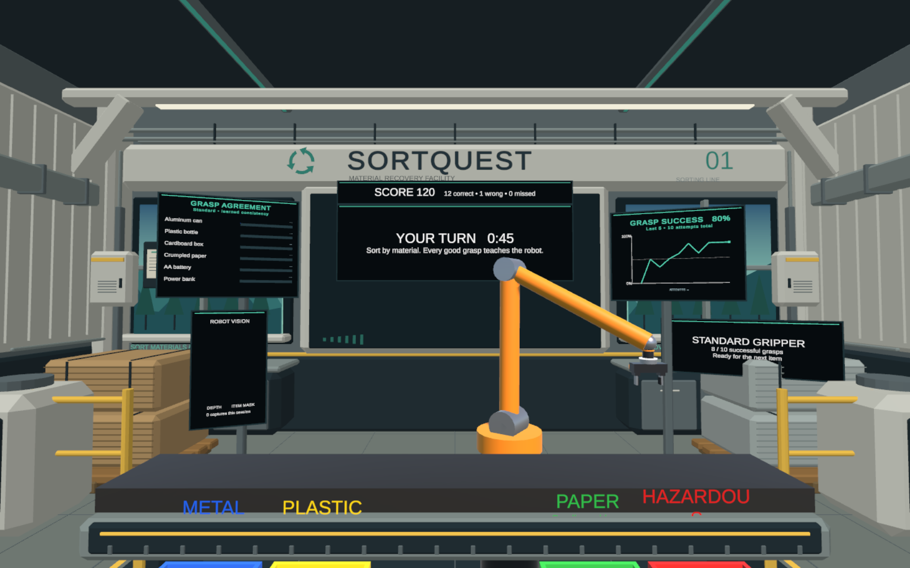
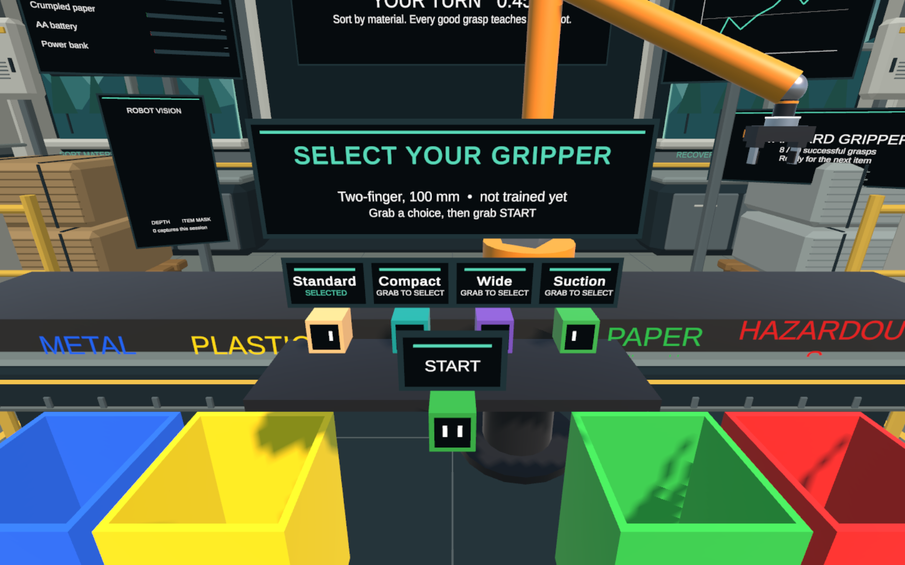
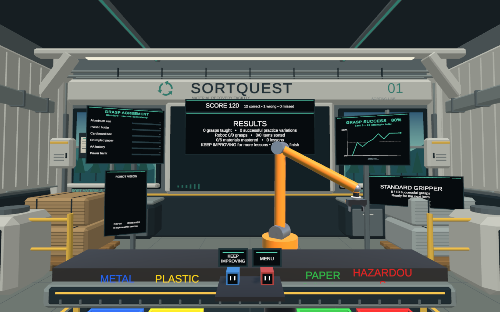

# Facility displays and UI

Open `Assets/Scenes/SampleScene.unity` and press Play to see the menu, charts, camera display, and live status. No Inspector wiring is required. The saved scene includes the fixed status panels and new environment details; menu cards and charts build at runtime.

## Changes

- Larger, high-contrast text on opaque charcoal displays with teal headings and trim.
- Fixed side displays for grasp agreement, grasp success, robot camera, and robot status. Shorter central instructions and results reduce repeated information.
- Gripper cards show a name and selection state, with the selected tool's description and training badge in one shared header. Grab controls have inset faces, grip marks, and selection indicators. START has more separation from the tool row.
- Grasp success has a current-sample marker, a clear empty state, and a rolling percentage. Agreement bars separate material names, taught/practiced counts, and percentages. Existing calculation and selection behavior remain unchanged.
- Additional ducts, service enclosures, cable risers, drain strips, display supports, fire equipment, and a notice board around the facility perimeter.

Trash models, conveyor, bins, and their gameplay components are unchanged. Saving the scene also serialized default fields from the previously pulled robot/menu code; those values match its existing defaults.

## Quest cost

The added scenery is one combined mesh with 2,408 triangles and one renderer, using the existing palette material. It adds no colliders, lights, rigidbodies, or shadow casting. Display cards use simple unlit quads. The display shader supports stereo instancing, and its resource material keeps it included in builds.

## Checks and previews

Validated in Unity 6000.3.25f1: script compilation and editor preview checks passed; the Android ARM64 IL2CPP development APK build succeeded with zero errors. Headset interaction, frame rate, and stereo readability have not been tested here.

`SortQuest > Preview Facility UI` renders temporary menu, gameplay, and result examples in the system temp folder, verifies the sample chart's 80% rolling result, and checks all default game-state status strings plus result controls for text overflow. It reloads the saved scene afterward. It does not start gameplay or write/upload grasp records.

The images below are editor renders with illustrative chart/status data. The camera preview is intentionally black because capture is not started by this tool. They do not demonstrate headset frame rate, tracking, or live database access.

For a headset check, inspect text from normal standing and seated heights, select each gripper, start a round, and confirm the menu hides while sorting. After a round, check KEEP IMPROVING and MENU. Inspect actual camera images and nonempty agreement bars, and profile frame rate on Quest 2. Moving robot geometry can still occlude world-space screens from some viewpoints.

`SortQuest > Polish Facility UI and Surroundings` reapplies the saved layout and replaces only the generated peripheral-detail mesh and display panels. Save custom scene work before using it.
