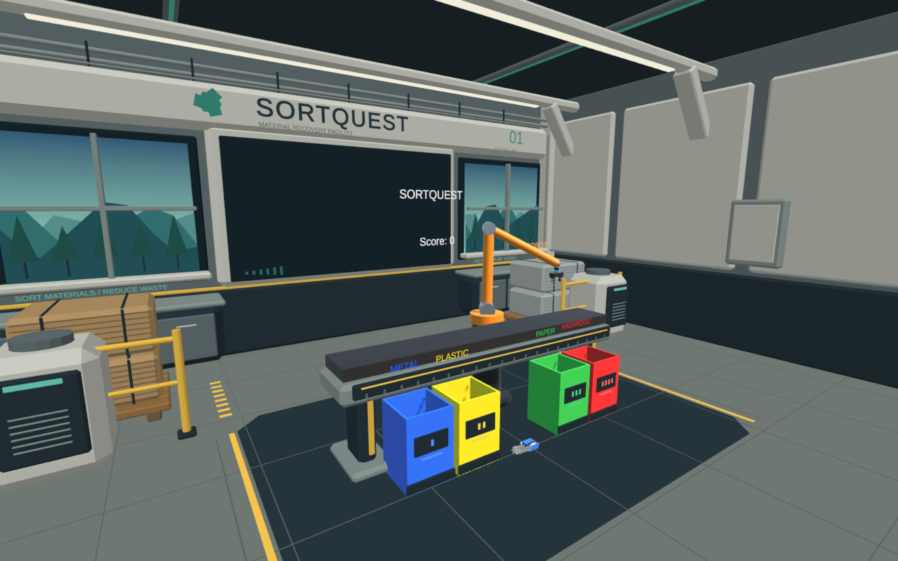

# Quest 2 facility visuals

Open `Assets/Scenes/SampleScene.unity`. The scene already includes the new visual
assets; no runtime setup or downloads are required. Select **Visual Set Dressing**
and press **F** in the Scene view to inspect the environment.

The design uses painted steel, corrugated wall panels, overhead utility lines,
concrete-style flooring, safety-yellow lane markings, palletized material bales,
window views, and a finished conveyor chassis. The original bin colors, live UI,
robot, interaction volume, and game object positions are retained.

## How the art stays inexpensive

The environment is constructed in the editor and saved as 12 combined mesh assets.
Their palette, bevel shading, and window gradients are stored in vertex colors.
The opaque URP shader samples no textures and computes no per-pixel lighting.
Six signs reuse the project's existing TMP font. Meshes are grouped by room zone
so they can still be culled independently. New scenery has no physics components
or update scripts, and does not cast shadows.

The existing mobile URP asset retains 4x MSAA and 0.8 render scale. Main-light shadow
distance is reduced from 50 to 12 meters, and unused additional lights are disabled.
The change adds no post-processing, bloom, SSAO, transparent glass, or realtime
reflections. See [the generated scene audit](QUEST_VISUAL_AUDIT.md) for measured
geometry counts and the hardware verification checklist.

## Editing and rebuilding

- The saved meshes/materials are under `Assets/Art/QuestLab`.
- `Assets/Shaders/QuestLabPalette.shader` is the shared stereo-compatible shader.
- `Assets/Editor/QuestSceneArt.cs` generates the environment.
- **SortQuest → Polish Scene Visuals** rebuilds the generated dressing and saves
  the scene. It replaces only the **Visual Set Dressing** hierarchy, restores the
  generated material assets, and checks snapshots of the original nonvisual
  components before saving. Treat that hierarchy as generated art.
- Original gameplay source files are not changed. Original object transforms,
  colliders, cameras, lights, and component references are retained; only the floor
  renderer's material and ambient color settings change on existing scene objects.

The preview uses the existing robot's visual constructors so its runtime model
appears instead of the editor placeholder. Preview-only objects are discarded,
and the scene is reloaded afterward. Gameplay and API clients are never started
for the preview.

No external art packs or new runtime packages are required. A connected Quest 2
is still needed to measure sustained frame rate and confirm both-eye rendering.

The scene also includes [48 used trash variants](TRASH_ART.md), with their own
shared atlas and inherited interaction prefabs. Their spawn list is already wired
into `SampleScene`; the six gameplay item types remain the same.

## Verification performed

- Saved-scene comparison: no original gameplay components, transforms, cameras,
  lights, or colliders changed; no gameplay C# source changes.
- Unity editor generated and rendered both previews without script errors.
- Palette shader compiled all required variants for Android OpenGL ES 3 and Vulkan.
- Physical Quest 2 profiling is pending; no headset was connected during this work.
- Standalone Android Development APK built successfully (Unity BuildReport: zero
  errors). The final APK including the trash models is approximately 100 MiB; ARM64 IL2CPP library and ZIP integrity
  verified. Minimum Android API 32, target API 34, matching existing project settings.
- Unrelated build-generated project settings were restored after the test.
