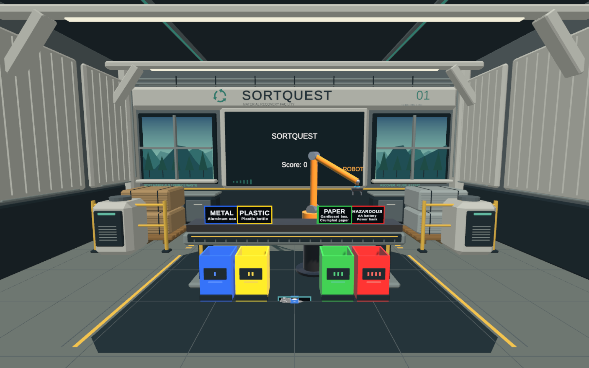

# Signs and interaction audio

Enter Play mode in SampleScene to see the new signs. `InteractionFeedback` installs automatically in scenes containing a TrashSpawner, including standalone builds; there are no manual Inspector assignments or scene edits.

- Bin signs use white type on dark panels with category-colored borders and stripes.
- Nearby trash (within 2.5 m of the main camera) has a floating name tag. Tags hide when held, sorted, or missed; the existing held-item label gets the same panel treatment.
- Pickups, releases, correct/incorrect sorts, robot pickups, and missed items play distinct short spatial cues. Item pickups vary pitch by item type. No correct-bin hints are added to item names.
- Audio uses eight reusable sources and six short, generated mono clips at 22,050 Hz (about 78 KiB of sample data). No downloaded sound assets, streaming, reverb, or per-frame audio synthesis.

During Play, select **Signs and interaction audio** and adjust **Volume** (0 mutes it). For a persistent default, change the serialized volume initializer in InteractionFeedback.cs. Category sign dimensions and nearby tag distance are defined in the presentation scripts.

**SortQuest → Preview and Check Signs and Audio** runs an edit-mode smoke check, invokes the event listeners on a temporary item, validates audio sample bounds, and writes `sortquest-signs-preview.png` to the system temporary directory. Save the scene first; the check reloads it afterward and does not save preview objects.

Hardware acceptance: in a Quest 2, check text at normal sorting distance, pick up/release each material, sort into correct and incorrect bins, listen to the robot round, and check volume comfort and frame timing. Local editor checks cannot verify headset readability, spatial audio perception, or device performance.

Validation: Unity 6000.3.25f1 compiled the scripts; presentation/event smoke checks passed; Android ARM64 IL2CPP development APK built with zero errors and passed ZIP integrity verification. Hardware testing remains outstanding.
