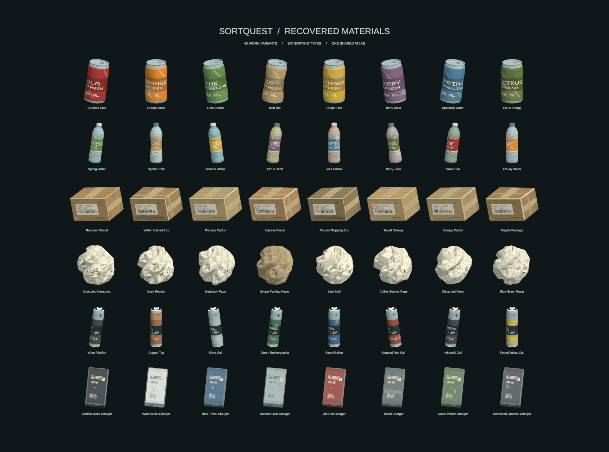

# Used trash models

The saved `SampleScene` now spawns 48 worn models: eight variations of each existing aluminum can, plastic bottle, cardboard box, crumpled paper, AA battery and power bank. No setup is needed after opening the project and allowing Unity to import the assets.

Open `Assets/Scenes/SampleScene.unity` and enter Play mode to see the random collection on the conveyor. Individual variants are in `Assets/Prefabs/TrashVariants`; the first model of each type remains in its original prefab path. Select a prefab to inspect it in Unity's preview, or double-click to open Prefab Mode.

## Art and performance

The meshes include rolled can rims, pull tabs, dents, bottle shoulders and ribs, cap grips, carton bevels and seams, folded paper, battery terminals and recessed charger ports. The atlas contains original fictional labels, printed paper, shipping labels, packing tape, scratches, chipped finishes, grime and stains. Geometry and wear patterns are deterministic and vary across the set.

All models share an opaque URP Simple Lit material and a 2048px atlas. Surface smoothness is packed into the atlas alpha channel. The Android importer uses ASTC 6×6 compression with mipmaps. There are no transparent layers, separate label renderers, downloaded asset dependencies or runtime mesh generators. Existing shadow settings are preserved. See [the generated audit](TRASH_ART_AUDIT.md) for measured triangle counts and validation results.

The existing six item IDs, sorting rules, masses, collider shapes, hand interaction components and local grasp coordinate frames remain unchanged. The bottle retains its original simplified cylindrical collision envelope, so small neck and dent details are cosmetic. Each type has eight entries in the existing random pool, preserving category weighting and the original first prefab used by augmentation.

## Rebuilding the artwork

The models and texture are already saved as Unity assets and work on another computer without running the generator. To deliberately regenerate them, save and open `SampleScene`, then choose **SortQuest → Trash Art → Rebuild Models and Wire Scene**. This overwrites the generated art and replaces the spawner's prefab list with this collection. It checks physics and interaction fingerprints before saving each prefab.

**SortQuest → Trash Art → Render Model Catalog** renders the catalog and close-up images into `docs/visuals`. It uses mesh-only copies in a temporary scene and never enters Play mode or connects to the API. Save your scene first.

All generation and validation code is in `Assets/Editor` and excluded from headset builds. Quest 2 frame time and actual hand grabbing still need an on-device check; triangle counts and an Android build are not a headset performance measurement.

## Verification performed

- Unity compiled the editor scripts, generated all 48 meshes and prefab references, and rendered the catalog and close-ups.
- All 48 prefab gameplay fingerprints matched their original type. The selection test passed 6,000 calls, covering the full pool, all type filters and the original training-prefab lookup.
- A separate file comparison confirmed unchanged colliders, rigidbodies, interaction components and local transforms. Unity serialized four already-existing `TrashItem` defaults explicitly; their values did not change. The scene's functional change is the 48-entry prefab list; six existing decorative text components also refreshed their color/style caches when Unity saved the scene.
- The final Android Development build succeeded with zero errors. The 99.89 MiB APK contains the ARM64 IL2CPP library and passed ZIP integrity validation. Build-generated changes to unrelated project settings were restored afterward.
- No runtime gameplay C# files or database schema were changed. Headset interaction and sustained frame rate remain unmeasured.
